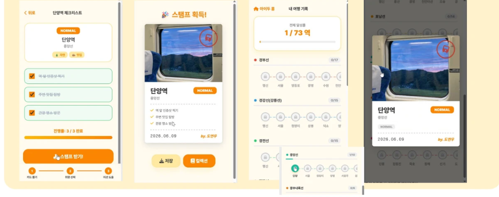
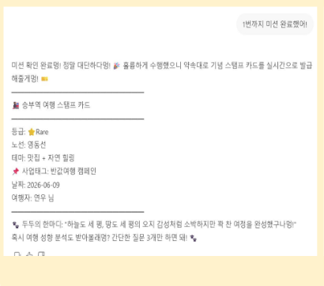

# AI-DO (아이두) 🚉 — 기차역 가챠 × AI 로컬 미션

> 전국 기차역을 랜덤으로 뽑아(가챠) 그 지역의 **AI 생성 로컬 미션**으로 바꾸고,
> 방문할 때마다 **스탬프 카드**로 아카이빙하는 웹 서비스.
> 인구감소 위험 지역에 가중치를 둬 **지방 소멸 대응**이라는 정책 목적을 담았습니다.

🏆 **2026 관광데이터 활용 공모전 — 생성형 AI 활용 관광 프롬프톤 부문(원티드랩 × 한국관광공사)
결선 진출** · 총 574팀 참여 → 예선 통과 195팀 → **결선 15팀**


- **기간**: 2026.05 ~ 2026.06 (구현 12일)
- **팀**: 아이두(AI-DO) 3인 — 기획·UI 디자인, 엔노이아 활용 팀원과 협업
- **역할**: **개발 (백엔드 · 인프라) 단독 구현**

---

## 서비스 흐름

```
역 가챠 뽑기 → AI 챗봇 '두두'가 역 주변 관광데이터로 현장 미션 생성
→ 미션 완료 체크 → 기념 스탬프 카드 발급 → 노선별 컬렉션 아카이빙
```


*가챠 뽑기 → 역 카드 획득 → AI 챗봇 '두두'와 취향 선택*


*미션 체크리스트 완료 → 스탬프 카드 획득 → 노선별 컬렉션(73역)*



*미션 완료 시 AI가 실시간으로 발급하는 기념 스탬프 카드 (등급 · 노선 · 테마 · 두두의 한마디)*

## 주요 기능

| 기능 | 설명 |
|------|------|
| 🎰 **가중치 가챠** | 인구감소 위험 지역에 더 높은 확률을 부여하는 가중 스코어링. 하루 5회 제한, 출발역·기보유 스탬프역 제외 |
| 🤖 **AI 미션 생성** | 한국관광공사 TourAPI의 역 주변 관광데이터를 LLM에 전달해 테마형 체크리스트 생성 (SSE 스트리밍) |
| 🏷 **스탬프 컬렉션** | 체크리스트 완료 시 스탬프 발급(단일 트랜잭션 보장), 노선별 수집 현황 아카이빙 |
| 🔐 **게스트 로그인** | JWT 기반 인증, 리소스 소유권 검증 |

## 아키텍처

```
Client (Vanilla JS)
   │
Nginx (reverse proxy, SSE proxy_buffering off)
   │
FastAPI (async) ──── PostgreSQL 16 (JSONB)
   │
   ├── TourAPI (한국관광공사) — TTL 캐시로 래핑
   └── LLM (미션/체크리스트 생성)
```

ERD · API 명세 · ADR 전체는 [docs/ARCHITECTURE.md](docs/ARCHITECTURE.md) 참고.

### 핵심 설계 결정 (ADR 요약)

- **PostgreSQL + JSONB** — AI가 생성하는 가변 구조의 미션 배열을 정규화 없이 유연하게 저장
- **모놀리식 단일 서버** — 12일 · 1인 규모에서 배포/디버깅 단순화, 단일 EC2로 비용 최소화
- **Vanilla JS** — 5페이지 미만 규모에서 SPA 프레임워크의 빌드 파이프라인은 오버헤드

## 트러블슈팅

### ① 공공 TourAPI 호출 한도 & 응답 지연

- **문제**: 미션을 생성할 때마다 같은 역의 주변 관광데이터를 TourAPI에 직접 호출 → 호출 한도 초과 위험 + 외부 API 응답 대기로 체감 속도 저하. 외부 API 장애 시 서비스 전체가 멈추는 구조.
- **해결**: TourAPI 응답을 **TTL(24h) 캐시로 래핑**해 중복 호출을 제거하고, 외부 API 실패 시 **fallback** 경로를 둬 서비스가 끊기지 않게 설계.
- **배운 것**: 외부 의존성은 캐싱·fallback으로 격리해야 서비스 가용성이 외부 API에 인질로 잡히지 않는다.

### ② 단순 랜덤이 아닌, 정책 목적을 담은 가챠

- **문제**: 균등 랜덤으로 역을 뽑으면 공모전 주제(지방 소멸 대응)와의 연결이 약함.
- **해결**: 인구감소 위험 지역에 더 높은 확률을 부여하는 **가중치 스코어링 알고리즘**을 설계하고, 가챠 규칙(일일 제한 · 중복 제외 · 전량 수집 시 종료)을 함께 정의.
- **배운 것**: 데이터와 도메인 목적을 알고리즘에 녹이면 단순 기능이 서비스의 메시지가 된다.

### ③ 생성 시점에 적용한 보안

LLM 출력 XSS 방어(저장 전 escape, 프론트 `textContent`만 사용), rate limiting(가챠·생성 API), 업로드 용량 제한, JWT 시크릿 환경변수 분리 등 — 보안을 사후 추가가 아닌 **생성 시점에 적용**.

## 실행 방법

```bash
# 1. 환경변수 설정
cp .env.example .env   # JWT_SECRET_KEY, TOUR_API_KEY 등 입력

# 2. 실행 (DB healthcheck 후 백엔드 기동)
docker compose up --build
```

## 프로젝트 구조

```
├── backend/          # FastAPI 앱 (routers · services · models)
├── frontend/         # Vanilla HTML/CSS/JS
├── nginx/            # 리버스 프록시 설정 (SSE 버퍼링 off)
├── docs/             # ARCHITECTURE.md (ERD · API · ADR)
└── docker-compose.yml
```
